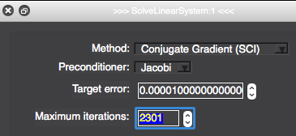

# SolveLinearSystem

The SolveLinearSystem module is used to solve the linear system $$Ax=b$$, where the coefficient matrix $$A$$ may be dense or sparse, $$b$$ is a given right-hand-side vector, and the user wants to find the solution vector $$x$$.

**Detailed Description**

The SolveLinearSystem module takes two input matrices and returns three matrices.
The first input port takes the coefficient matrix $$A$$, which may be a dense $$n \times n$$ matrix or a sparse $$n \times n$$ matrix.
The second input port takes the right hand side vector $$b$$ as an $$n \times 1$$ dense matrix.
Here, the module is assuming that an $$n \times n$$ system is being solved.

The first of the three output ports returns the solution vector $$x$$ as an $$n \times 1$$ dense matrix.
The second output port returns the number of iterations required to reach convergence as a $$1 \times 1$$ dense matrix and the third output port returns the norm of the residual vector, again as a $$1 \times 1$$ dense matrix.

The GUI for this module is used to define the solution method for the module and monitor the convergence towards the solution.

#### Methods Tab

The Methods tab allows the user to select one of four solution algorithms for numerically solving sparse systems of linear equations:

1. Conjugate gradient
2. Biconjugate gradient
3. Jacobi
4. MINRES

Each solution method comes with the option of choosing a preconditioner for the numerical solution algorithm, which is set with the Preconditioners tab:

At present, only the Jacobi preconditioner is available.
However, there is the option of using no preconditioning.

#### Convergence Criteria

The next section of the GUI sets up the convergence criteria for the numerical
solution.

To achieve convergence of the numerical solution, the norm of the residual must be less than the target error as given in the slider.
The next slider sets the maximum number of iterations that are allowed to achieve solution.
This can take a value anywhere between 0 and 20000.

The module has the ability to write solutions at regular intervals and this flag is set by clicking on the **Emit partial solutions** check-box.
The frequency of writing the solutions is set with the next slider.

Finally, the option **Use the previous solution as initial guess**, which is set by clicking the check-box, allows the user to either continue a simulation run looking for better convergence, or run a second simulation for which it is expected that the second solution may be close to the first.

A useful strategy for solving simulation problems is to begin with a small number of iterations to check that the solution will converge and then use the **Use the previous solution as initial guess** option to continue the simulation.
Alternatively, to stop a diverging, or at least non-converging, simulation the Target error can be dynamically changed to a residual error level already obtained by the solver.

#### Iteration Progress

The bottom section of the GUI shows how the solution is progressing.

There is an iteration counter to show how many iterations have been completed, the value of the original error (this will be 1.0 unless the  **Use the previous solution as initial guess** option has been used) and thevalue of the current error.
These quantities are summarised graphically in the convergence plot.

Further reading: [http://www-users.cs.umn.edu/~saad/books.html Y. Saad, Iterative methods for sparse linear systems, second edition (2000)].
